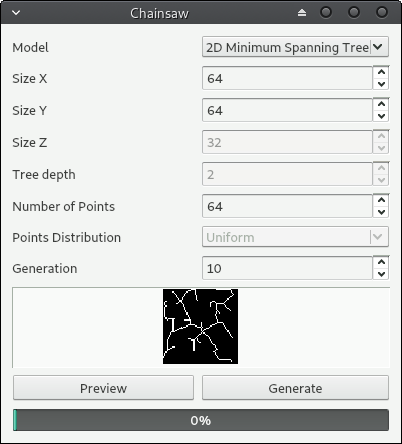

# Chainsaw
Graph/Tree-like Image Generator for deep learning datasets

## Features
* Preview image
* Generate png images dataset (custom size of dataset)
* Custom size of image
* Binary Tree model
  * Custom tree depth
* Minimum Spanning Tree model
  * Custom number of Points
  
## Todo list
* 3D images dataset
* Minimum Spanning Tree model
  * Custom distribution
  * Better line width

### Version : 1.2